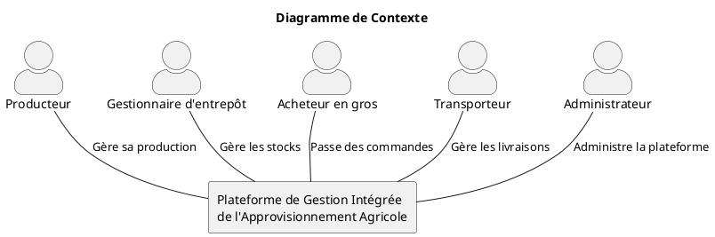
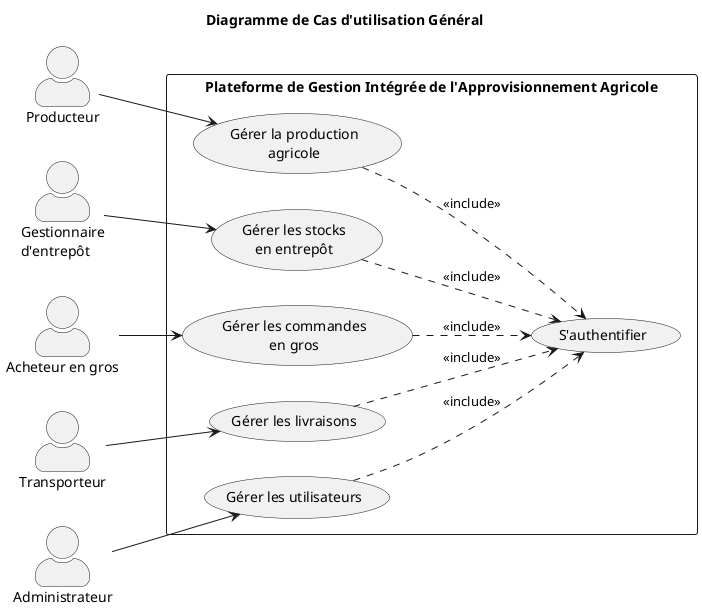
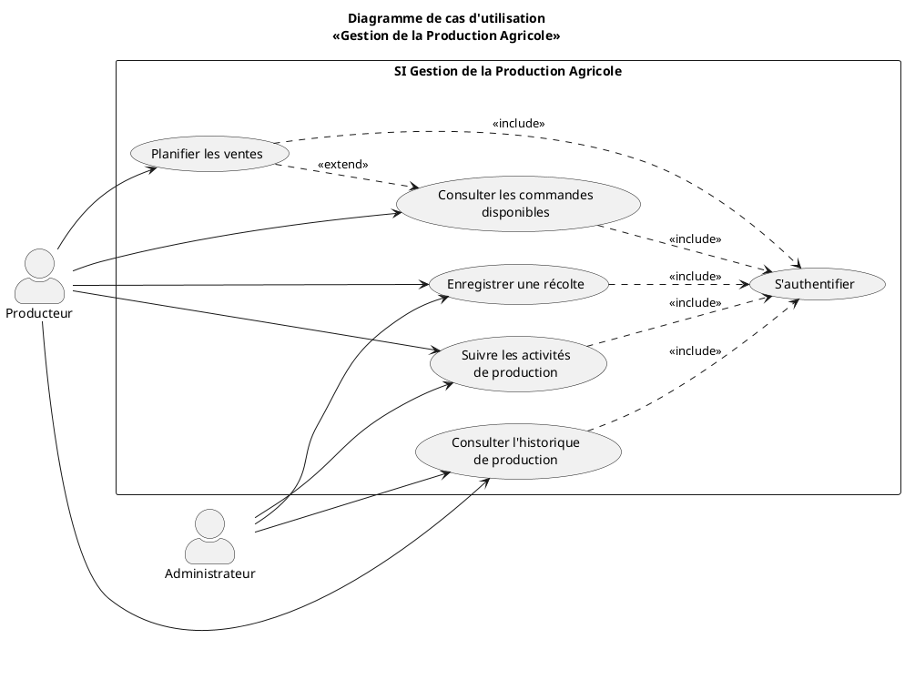
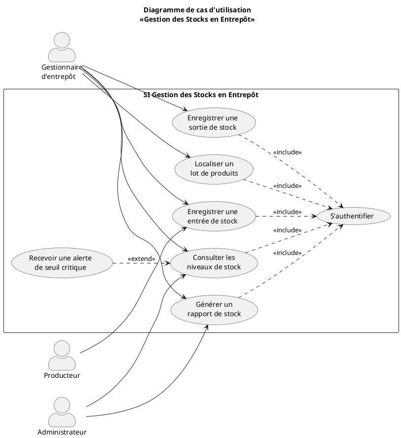
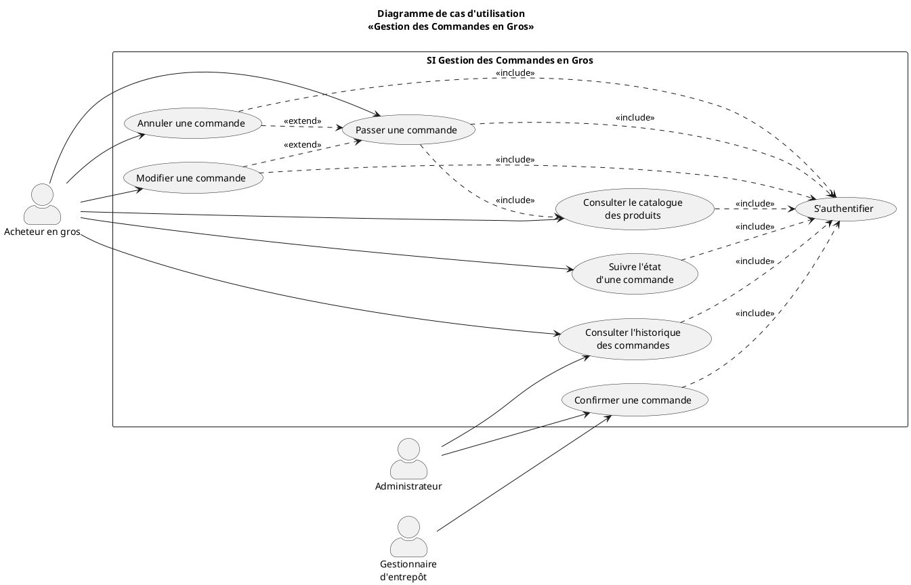
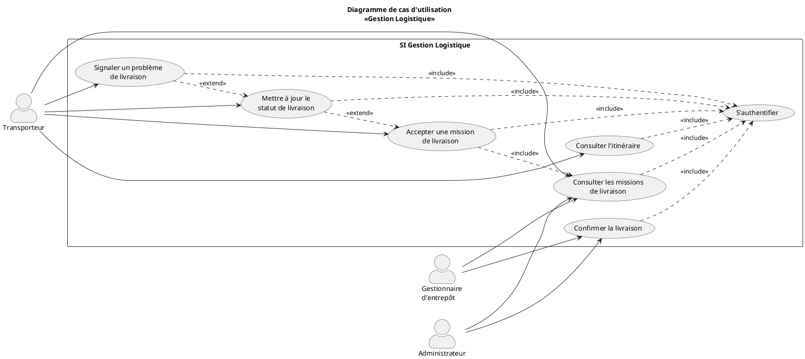
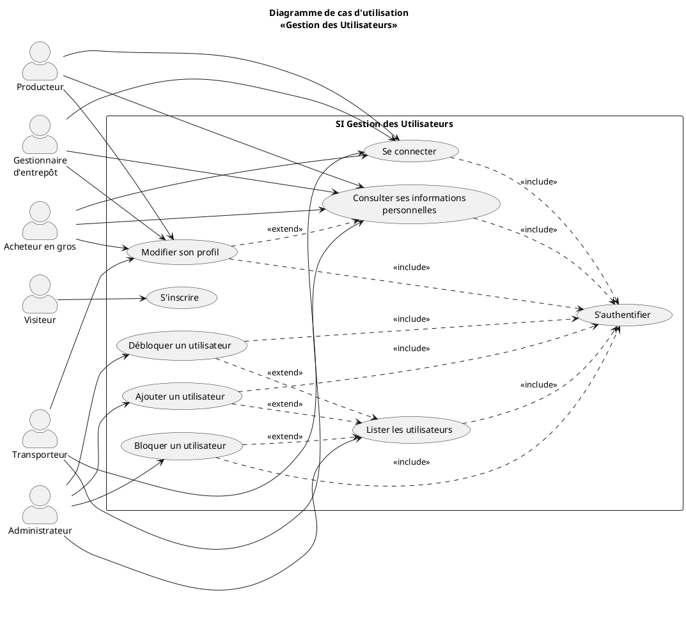
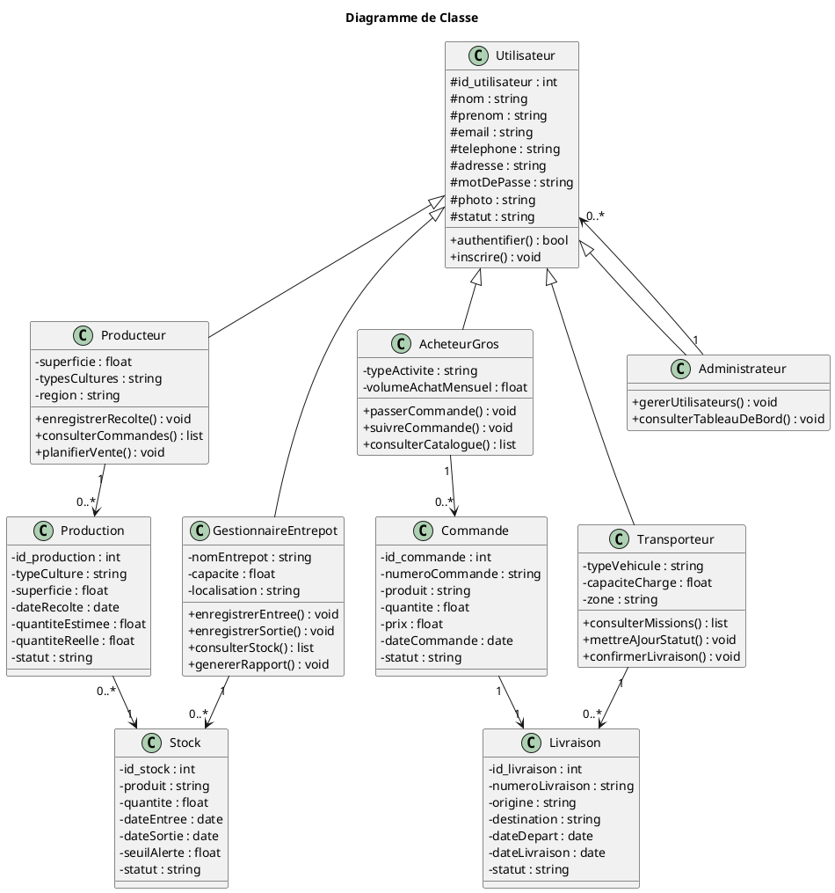
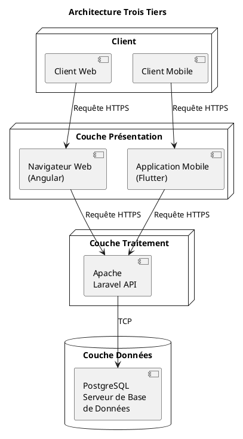

# Cahier des Charges Technique

## Plateforme de Gestion Intégrée de l’Approvisionnement Agricole

**Projet de fin de cycle — Licence 3 Génie Logiciel — ISI Sénégal**
**Étudiant :** Souleye Bachir Aliou Sarr
**Encadreur :** Mr. Matar Thioye
**Document destiné à :** Claude Code (agent de développement)

-----

## 1. Contexte du projet

Ce document est le cahier des charges technique complet du projet de mémoire. Il doit être utilisé comme contexte de référence pour toute l’implémentation. Le projet consiste à développer une plateforme Web et Mobile permettant de centraliser et coordonner les échanges entre producteurs, gestionnaires d’entrepôts, acheteurs en gros et transporteurs, dans le secteur agricole au Sénégal.

L’implémentation doit rester strictement fidèle aux diagrammes UML déjà conçus (diagramme de classe, diagrammes de cas d’utilisation) fournis dans ce document. Ne pas ajouter de fonctionnalités non prévues. Ne pas simplifier les modules sans en informer l’utilisateur au préalable.

**Note importante :** les maquettes Figma ne sont pas encore réalisées au moment de la rédaction de ce document. Claude Code peut commencer le développement des interfaces avec une UI fonctionnelle simple basée sur les cas d’utilisation ci-dessous, mais doit prévoir que l’apparence visuelle (couleurs, mise en page détaillée) sera ajustée une fois les maquettes Figma disponibles.

-----

## 2. Stack technique imposée

|Couche            |Technologie   |Version recommandée                    |
|------------------|--------------|---------------------------------------|
|Frontend Web      |Angular       |Dernière version stable LTS disponible |
|Backend API       |Laravel (PHP) |Laravel le plus récent stable, PHP 8.3+|
|Application Mobile|Flutter (Dart)|Dernière version stable du SDK Flutter |
|Base de données   |PostgreSQL    |16 ou plus récent                      |
|Conteneurisation  |Docker        |Dernière version stable                |
|CI/CD             |Jenkins       |LTS                                    |
|Qualité de code   |SonarQube     |Community Edition, dernière version    |
|Versioning        |Git / GitHub  |—                                      |

Note pour Claude Code : vérifie les versions stables actuellement disponibles au moment de l’installation plutôt que de te fier à un numéro figé dans ce document, et signale à l’utilisateur la version exacte choisie pour qu’il la documente dans le mémoire (section 2.4.1.3).

Architecture : trois tiers (Présentation / Traitement métier / Accès aux données), communication via API REST en HTTPS.

-----

## 3. Acteurs du système (5 rôles)

1. **Producteur** — enregistre sa production, consulte les commandes, planifie ses ventes.
1. **Gestionnaire d’entrepôt** — gère les entrées/sorties de stock, consulte les niveaux, génère des rapports.
1. **Acheteur en gros** — consulte le catalogue, passe et suit ses commandes.
1. **Transporteur** — consulte ses missions de livraison, met à jour le statut des livraisons.
1. **Administrateur** — gère les utilisateurs, accède aux tableaux de bord globaux.

Chaque acteur a un rôle distinct stocké dans la table `utilisateurs` via un champ `role`. L’authentification doit utiliser Laravel Sanctum avec un middleware de vérification de rôle pour chaque route protégée.

### Répartition Web / Mobile par acteur

Conformément aux enquêtes de terrain (les producteurs et transporteurs travaillent sur le terrain, les gestionnaires d’entrepôt et administrateurs travaillent davantage depuis un poste fixe), la répartition est la suivante :

|Acteur                 |Web (Angular)                   |Mobile (Flutter)         |
|-----------------------|--------------------------------|-------------------------|
|Producteur             |Oui (consultation)              |Oui — usage principal    |
|Gestionnaire d’entrepôt|Oui — usage principal           |Oui (consultation rapide)|
|Acheteur en gros       |Oui — usage principal           |Oui (consultation rapide)|
|Transporteur           |Non                             |Oui — usage principal    |
|Administrateur         |Oui — usage principal uniquement|Non                      |

Cette répartition est une proposition par défaut. Si elle ne correspond pas à ce qui a été validé avec l’encadreur, l’utilisateur doit la corriger avant que Claude Code ne commence le développement des interfaces.

-----

## 4. Schéma de base de données (PostgreSQL)

### Table `utilisateurs`

```sql
CREATE TABLE utilisateurs (
  id SERIAL PRIMARY KEY,
  nom VARCHAR(100) NOT NULL,
  prenom VARCHAR(100) NOT NULL,
  email VARCHAR(150) UNIQUE NOT NULL,
  telephone VARCHAR(20),
  adresse VARCHAR(255),
  mot_de_passe VARCHAR(255) NOT NULL,
  photo VARCHAR(255),
  role VARCHAR(30) NOT NULL CHECK (role IN ('producteur','gestionnaire_entrepot','acheteur_gros','transporteur','administrateur')),
  statut VARCHAR(20) DEFAULT 'actif' CHECK (statut IN ('actif','bloque')),
  created_at TIMESTAMP DEFAULT NOW(),
  updated_at TIMESTAMP DEFAULT NOW()
);
```

### Table `producteurs` (extension du profil)

```sql
CREATE TABLE producteurs (
  id SERIAL PRIMARY KEY,
  utilisateur_id INT REFERENCES utilisateurs(id) ON DELETE CASCADE,
  superficie FLOAT,
  types_cultures VARCHAR(255),
  region VARCHAR(100)
);
```

### Table `entrepots`

```sql
CREATE TABLE entrepots (
  id SERIAL PRIMARY KEY,
  utilisateur_id INT REFERENCES utilisateurs(id) ON DELETE CASCADE,
  nom_entrepot VARCHAR(150),
  capacite FLOAT,
  localisation VARCHAR(255)
);
```

### Table `acheteurs_gros`

```sql
CREATE TABLE acheteurs_gros (
  id SERIAL PRIMARY KEY,
  utilisateur_id INT REFERENCES utilisateurs(id) ON DELETE CASCADE,
  type_activite VARCHAR(150),
  volume_achat_mensuel FLOAT
);
```

### Table `transporteurs`

```sql
CREATE TABLE transporteurs (
  id SERIAL PRIMARY KEY,
  utilisateur_id INT REFERENCES utilisateurs(id) ON DELETE CASCADE,
  type_vehicule VARCHAR(100),
  capacite_charge FLOAT,
  zone VARCHAR(150)
);
```

### Table `productions`

```sql
CREATE TABLE productions (
  id SERIAL PRIMARY KEY,
  producteur_id INT REFERENCES producteurs(id) ON DELETE CASCADE,
  code_tracabilite VARCHAR(50) UNIQUE NOT NULL,
  type_culture VARCHAR(100),
  superficie FLOAT,
  date_recolte DATE,
  quantite_estimee FLOAT,
  quantite_reelle FLOAT,
  statut VARCHAR(30) DEFAULT 'en_attente',
  created_at TIMESTAMP DEFAULT NOW()
);
```

Le `code_tracabilite` est généré automatiquement à la création de chaque production (ex: UUID ou code type LOT-2026-00001). Il permet de suivre le produit tout au long de la chaîne via les clés étrangères déjà présentes (`production_id` dans `stocks`, `stock_id` dans `commandes`, `commande_id` dans `livraisons`).

### Table `stocks`

```sql
CREATE TABLE stocks (
  id SERIAL PRIMARY KEY,
  entrepot_id INT REFERENCES entrepots(id) ON DELETE CASCADE,
  production_id INT REFERENCES productions(id) ON DELETE SET NULL,
  produit VARCHAR(150),
  quantite FLOAT,
  date_entree DATE,
  date_sortie DATE,
  seuil_alerte FLOAT,
  statut VARCHAR(30) DEFAULT 'disponible'
);
```

### Table `commandes`

```sql
CREATE TABLE commandes (
  id SERIAL PRIMARY KEY,
  numero_commande VARCHAR(50) UNIQUE,
  acheteur_id INT REFERENCES acheteurs_gros(id) ON DELETE CASCADE,
  stock_id INT REFERENCES stocks(id),
  produit VARCHAR(150),
  quantite FLOAT,
  prix FLOAT,
  date_commande TIMESTAMP DEFAULT NOW(),
  statut VARCHAR(30) DEFAULT 'en_attente' CHECK (statut IN ('en_attente','confirmee','annulee','livree'))
);
```

### Table `livraisons`

```sql
CREATE TABLE livraisons (
  id SERIAL PRIMARY KEY,
  numero_livraison VARCHAR(50) UNIQUE,
  commande_id INT REFERENCES commandes(id) ON DELETE CASCADE,
  transporteur_id INT REFERENCES transporteurs(id),
  origine VARCHAR(255),
  destination VARCHAR(255),
  date_depart TIMESTAMP,
  date_livraison TIMESTAMP,
  statut VARCHAR(30) DEFAULT 'en_attente' CHECK (statut IN ('en_attente','en_cours','livree','probleme'))
);
```

-----

## 5. Structure du projet attendue

```
projet-agri-platform/
├── backend/                  (Laravel API)
│   ├── app/
│   │   ├── Models/
│   │   ├── Http/Controllers/Api/
│   │   ├── Http/Middleware/
│   │   └── Http/Requests/
│   ├── database/migrations/
│   ├── routes/api.php
│   └── docker/
├── frontend-web/              (Angular)
│   ├── src/app/
│   │   ├── core/ (auth, guards, interceptors)
│   │   ├── features/
│   │   │   ├── producteur/
│   │   │   ├── entrepot/
│   │   │   ├── acheteur/
│   │   │   ├── transporteur/
│   │   │   └── admin/
│   │   └── shared/
├── mobile-app/                 (Flutter)
│   ├── lib/
│   │   ├── models/
│   │   ├── screens/
│   │   ├── services/
│   │   └── widgets/
├── docker-compose.yml
├── Jenkinsfile
└── sonar-project.properties
```

-----

## 6. Endpoints API REST (Laravel)

### Authentification

- `POST /api/register` — inscription (avec champ `role`)
- `POST /api/login` — connexion, retourne token Sanctum
- `POST /api/logout`
- `GET /api/me` — profil utilisateur connecté
- `PUT /api/profile` — mise à jour du profil

### Module Producteur

- `GET /api/productions` — liste des productions du producteur connecté
- `POST /api/productions` — enregistrer une récolte
- `PUT /api/productions/{id}` — modifier une production
- `GET /api/commandes/disponibles` — consulter les commandes/demandes disponibles

### Module Gestionnaire d’entrepôt

- `GET /api/stocks` — liste des stocks de l’entrepôt
- `POST /api/stocks/entree` — enregistrer une entrée
- `POST /api/stocks/sortie` — enregistrer une sortie
- `GET /api/stocks/alertes` — produits sous le seuil critique
- `GET /api/stocks/rapport` — rapport d’inventaire

### Module Acheteur en gros

- `GET /api/catalogue` — liste des produits disponibles (tous entrepôts)
- `POST /api/commandes` — passer une commande
- `PUT /api/commandes/{id}` — modifier une commande
- `DELETE /api/commandes/{id}` — annuler une commande
- `GET /api/commandes/historique` — historique des commandes

### Module Transporteur

- `GET /api/livraisons` — missions assignées au transporteur
- `PUT /api/livraisons/{id}/statut` — mettre à jour le statut
- `POST /api/livraisons/{id}/probleme` — signaler un problème

### Module Administrateur

- `GET /api/admin/utilisateurs` — liste de tous les utilisateurs
- `POST /api/admin/utilisateurs` — ajouter un utilisateur
- `PUT /api/admin/utilisateurs/{id}/bloquer`
- `PUT /api/admin/utilisateurs/{id}/debloquer`
- `GET /api/admin/dashboard` — statistiques globales (productions, stocks, commandes, livraisons)

### Module Traçabilité (transversal, accessible à tous les acteurs authentifiés)

- `GET /api/tracabilite/{code_tracabilite}` — retourne le parcours complet d’un lot : informations de production, mouvements de stock (entrepôt, dates), commande associée, statut de livraison. C’est l’implémentation directe de l’objectif officiel “Traçabilité des produits” du sujet de mémoire ; elle ne doit pas être omise.

### Règles métier critiques (à respecter impérativement)

1. **Une commande ne peut être créée que si `quantite` demandée ≤ `quantite` disponible dans le `stock` ciblé.** Si insuffisant, retourner une erreur 422 explicite, jamais une commande partielle silencieuse.
1. Lorsqu’une commande passe au statut `confirmee`, la quantité correspondante doit être déduite du `stock` associé (transaction atomique).
1. Une `livraison` ne peut être créée qu’à partir d’une commande au statut `confirmee`.
1. Si une `livraison` passe au statut `probleme`, la commande associée doit repasser visuellement en alerte côté acheteur (pas de changement automatique de statut commande sans confirmation humaine).
1. Le `code_tracabilite` doit rester lisible et traçable même si la production est répartie sur plusieurs entrepôts (cas à anticiper mais qui peut être simplifié en V1 avec confirmation explicite de l’utilisateur avant de coder cette complexité).

-----

## 7. Règles d’autorisation (middleware par rôle)

Chaque route ci-dessus (sauf register/login) doit être protégée par :

1. Middleware `auth:sanctum` (utilisateur connecté)
1. Middleware personnalisé `role:nom_du_role` vérifiant que le `role` de l’utilisateur correspond au module appelé

Exemple : les routes `/api/stocks/*` ne sont accessibles qu’aux utilisateurs avec `role = gestionnaire_entrepot` ou `role = administrateur`.

-----

## 8. Environnement Docker attendu

`docker-compose.yml` doit définir au minimum les services suivants :

- `app` (PHP-FPM + Laravel)
- `webserver` (Nginx)
- `db` (PostgreSQL, avec volume persistant)
- `frontend` (Angular en mode dev, port 4200)

-----

## 9. Pipeline Jenkins attendu

Le `Jenkinsfile` doit inclure au minimum les étapes :

1. Checkout du code (GitHub)
1. Installation des dépendances (composer install, npm install)
1. Exécution des tests (PHPUnit pour Laravel)
1. Analyse SonarQube
1. Build des conteneurs Docker

-----

## 10. Ordre de développement recommandé

1. Initialisation du dépôt Git + structure des dossiers
1. Mise en place Docker (Laravel + PostgreSQL + Nginx)
1. Migrations de base de données (tables ci-dessus)
1. Authentification et gestion des rôles (backend)
1. Module Producteur (API + interface Angular + écran Flutter)
1. Module Gestionnaire d’entrepôt
1. Module Acheteur en gros
1. Module Transporteur
1. Module Administrateur
1. Intégration Jenkins + SonarQube
1. Tests et corrections de bugs
1. Déploiement final

-----

## 11. Conventions de code

- Backend : respecter PSR-12, noms de variables en français autorisés (cohérence avec la base de données), contrôleurs en anglais standard Laravel (Resource Controllers).
- Frontend Angular : Angular Style Guide officiel, composants standalone si possible, services pour les appels API.
- Mobile Flutter : structure par feature, gestion d’état simple (Provider ou Riverpod selon préférence).
- Tous les commits Git doivent avoir des messages clairs en français décrivant la fonctionnalité ajoutée.

-----

## 12. Instruction finale pour Claude Code

Tu es chargé de l’implémentation complète de ce projet à partir de ce cahier des charges. Procède module par module dans l’ordre recommandé en section 10. Avant chaque module, confirme avec l’utilisateur la compréhension du périmètre. Ne saute aucune étape. Signale toute incohérence ou question avant de coder. Documente chaque commande exécutée et chaque fichier créé.

-----

## Annexe : Diagrammes UML sources (PlantUML)

Ces codes sont la source exacte des diagrammes déjà intégrés dans le mémoire (Chapitre 2, section 2.3). Ils servent de référence de vérification : toute table, tout endpoint, toute règle métier de ce document doit rester cohérent avec ces diagrammes. En cas de divergence constatée, signale-la à l’utilisateur avant de coder.

### Diagramme de Contexte



### Diagramme de Cas d’utilisation Général



### Cas d’utilisation : Gestion de la Production Agricole



### Cas d’utilisation : Gestion des Stocks en Entrepôt



### Cas d’utilisation : Gestion des Commandes en Gros



### Cas d’utilisation : Gestion Logistique



### Cas d’utilisation : Gestion des Utilisateurs



### Diagramme de Classe



### Architecture Trois Tiers

